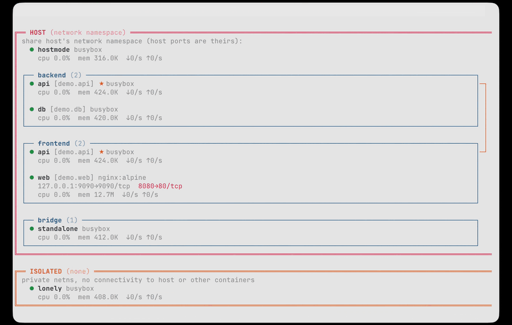

---

# Yeet Scripts

**Turn JavaScript files into bespoke tools.**

[](https://yeet.cx)
[](https://yeet.cx)
[](./CLAUDE.md)

Yeet scripts are JavaScript ES modules that subscribe to a live system graph — CPU, memory, processes, network, docker — and render or act on the data. No rebuild loop. The script you write this afternoon is the tool you ship.

This repo contains three scripts you can run and modify today:

- **[`proctop`](#modifying-scripts-with-proctop)** — a `top(1)`-like process viewer: live %CPU, memory, and full command lines, sortable by any column.
- **[`docker-net`](#making-new-connections-with-docker-net)** — a spatial, live-updating map of every container on the host, grouped by docker network.
- **[`metropolis`](#having-fun-with-metropolis)** — an art-deco city that breathes your system: skyscrapers, neon billboards, and your top processes walking the boulevard as citizens.

## Run a script in 60 seconds

Requirements:

- A Linux machine (bare metal, VM, EC2 — anything with a kernel).
- The yeet daemon:

  ```sh
  curl -fsSL https://yeet.cx | sh
  ```

Then clone this repo and run any script:

```sh
git clone https://github.com/yeet-src/yeet-scripts.git
cd yeet-scripts
yeet run examples/docker-net/render.js
```

The daemon runs locally, the script runs locally, the data stays on the machine.

## What scripts can see

Scripts subscribe to a GraphQL system graph that covers:

- **Processes** — every PID on the system: command line, exe path, CPU time (utime/stime), resident memory, disk I/O bytes, scheduler run delay, and process state (running / sleeping / zombie). Individual process or full `procs` list, live or one-shot.
- **CPU** — per-core utilization broken out by user, nice, system, idle, iowait, irq, and steal. Core model, vendor, flags, and current/min/max clock frequencies via `cpufreq`.
- **Memory** — full `/proc/meminfo` surface: total, free, available, buffers, cached, swap, slab, hugepages, vmalloc.
- **Network** — per-interface metadata (type, MAC, flags, link speed, gateway, DNS) and live counters (rx/tx bytes, packets, errors, drops) from `/proc/net/dev`.
- **Kernel** — context switches, boot time, running and blocked process counts, load average (1/5/15 min).
- **Docker** — container list with names, image, ports, labels, network membership, and Compose project/service metadata. Live per-container stats (CPU, memory, blkio, network I/O) and streaming logs.
- **Nvidia GPUs** — per-device power draw, temperature, fan speed, and utilization (GPU/SM/encoder/decoder). Per-process GPU memory and utilization via NVML.
- **Hardware sensors** — temperatures, fan speeds, and voltage readings from any hwmon device exposed under `/sys/class/hwmon`.

Run `yeet graph dump` for the full SDL, or `yeet graph query '<gql>'` to probe any field interactively.

## Yeet script examples

Scripts are ES modules — they can `import` from other scripts or `.gql` files, and the examples split cleanly into a `data.js` (system graph queries) and a `render.js` (terminal output). Read them. Edit them. Make them yours.

### Modifying scripts with `proctop`


[`examples/proctop`](./examples/proctop) is a `top(1)`-like process viewer. Every row is a process; columns show PID, %CPU, resident memory, and the full command line. The layout is driven by a single `COLUMNS` array in `render.js` — to add a field, append one entry and fetch the data in `data.js`. Nothing else changes.

```sh
# live view, redraws every 1.5s
yeet run examples/proctop/render.js

# one snapshot to stdout (pipe-safe)
yeet run examples/proctop/render.js --once

# sort by memory instead of CPU
yeet run examples/proctop/render.js --sort mem

# raw event stream, one JSON object per line
yeet run examples/proctop/dump.js
```

Scripts expose a small set of globals (`yeet.graph.subscribe`, `tty`, `style`, timers) with no Node API, no `require`, no hidden runtime — which makes them easy for a coding model to read and modify. Drop [`skill.md`](./skill.md) into your Claude Code skills directory and ask it to build the script you actually want.

**Guide:** [Adding a column to proctop](./guides/edit-proctop.md) — a worked example of the data/render split.

### Making new connections with `docker-net`



[`examples/docker-net`](./examples/docker-net) draws your docker host as nested boxes: an outer **HOST** containing one box per bridge network, every container placed in the network it belongs to, host-mode containers at the top level, and isolated (`--network=none`) containers in their own **ISOLATED** box outside the host. Multi-network containers are flagged. Compose project / service labels and exposed ports are surfaced inline.

```sh
# live view, redraws every 2s in the alt-screen
yeet run examples/docker-net/render.js

# one snapshot to stdout (pipe-safe)
yeet run examples/docker-net/render.js --once

# raw event stream, one JSON object per line
yeet run examples/docker-net/dump.js
```

The script splits cleanly: [`data.js`](./examples/docker-net/data.js) does a `docker.list_containers` query against the system graph and normalizes the result; [`render.js`](./examples/docker-net/render.js) is pure presentation. Want a different layout, a different grouping, a Slack alert when a container joins a sensitive network? Edit `render.js`, or replace it. The data layer doesn't care.

A [`demo.sh`](./examples/docker-net/demo.sh) is included to spin up a small multi-network stack so you have something interesting to look at:

```sh
./examples/docker-net/demo.sh up
yeet run examples/docker-net/render.js
./examples/docker-net/demo.sh down
```

### Having fun with `metropolis`


[`examples/metropolis.js`](./examples/metropolis.js) is a fun example of what the render engine can do.

```sh
yeet run examples/metropolis.js
```

You're looking at an art-deco skyline with twinkling windows and a neon Tux billboard. The little figures walking the boulevard below are your top CPU-spending processes — running ones sprint, sleeping ones sway, zombies get a red ✕. The footer keeps the actual numbers honest.

## Where to go next

- [yeet.cx](https://yeet.cx) — learn about the yeet platform
- [`skill.md`](./skill.md) — drop this into your coding model's skills directory
- [`examples/`](./examples/) — browse all scripts

---

[Read the docs](./CLAUDE.md)
